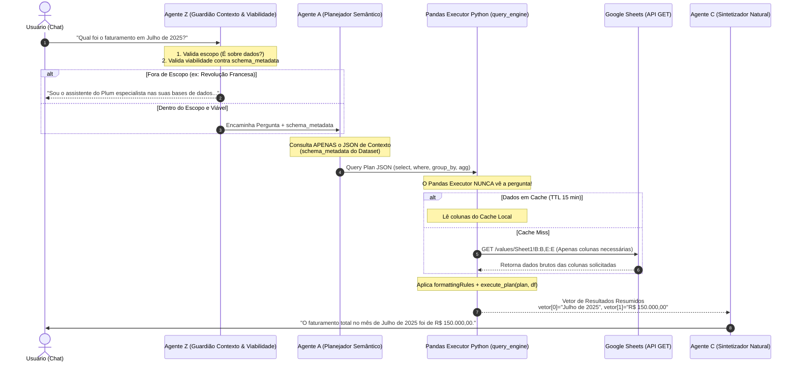

# PRD: Arquitetura Multitenant do Chat Conversacional & Query Engine 💬🧠

## 1. Visão Geral do Produto
O **Plum Chat Conversacional** é um motor enterprise de inteligência de dados (*Natural Language Query Engine*) projetado para permitir que usuários façam perguntas em linguagem natural sobre suas planilhas e bases de dados (conectadas via **Google Sheets**) e recebam respostas precisas, rápidas e contextualizadas.

A arquitetura adota um pipeline modular composto pelo **Agente Z (Guardião)**, pelo **Agente A (Planejador Semântico)**, pelo **Pandas Executor em Python (Motorista Cego)** e pelo **Agente C (Sintetizador Natural)**, garantindo **Multitenancy Estrito (Isolamento entre empresas)**, privacidade de dados e **precisão matemática de 100%**.

---

## 2. Princípios Fundamentais da Arquitetura

1. **Agente Z como Primeiro Filtro:** Qualquer mensagem é auditada antes de processar queries. Perguntas fora de contexto (ex: Revolução Francesa) são bloqueadas com resposta institucional amigável. Perguntas sobre colunas inexistentes na planilha são filtradas na hora.
2. **Cálculo Determinístico via Python/Pandas (`query_engine/pandas_executor.py`):** Modelos de IA (LLMs) **não realizam matemática**. O Agente A apenas gera um plano estruturado (Query Plan JSON). Quem executa o filtro, agrupamento e cálculos numéricos é o código Python em Pandas, eliminando 100% das alucinações numéricas.
3. **Motorista Cego (Blind Execution Pattern):** O `pandas_executor.py` não recebe a pergunta do usuário e não conhece a intenção de negócio. Ele lê apenas a instrução JSON estrita e os dados brutos necessários. Isso garante privacidade de PII e performance.
4. **Acesso Somente Leitura (`GET` HTTP) + Column-Range GET + Cache TTL:** O Plum **nunca** altera a planilha do cliente. Ele lê **somente as colunas especificadas pelo Agente A** (ex: `Sheet1!B:B,E:E`) via requisições HTTP `GET` e armazena os dados em um Cache TTL (Redis/Memória), poupando requisições e contornando o limite de 60 req/min da API do Google Sheets.
5. **Multitenancy Inquebrável (Isolamento por `organization_id` & RLS):** Todas as chamadas validam o token JWT do usuário no Supabase Postgres. Nenhuma consulta ao Google Sheets ocorre sem a validação do `dataset_id` e `organization_id` correspondentes.

---

## 3. Fluxo de Execução E2E (Diagrama de Sequência)



---

## 4. Detalhamento dos Componentes e Agentes

### 🛡️ Agente Z: Guardião de Contexto & Viabilidade (*The Gatekeeper*)
- **Entradas:** Pergunta em linguagem natural + `schema_metadata` do Dataset.
- **Responsabilidade 1 (Contexto & Escopo):** 
  - Se a pergunta for totalmente alheia a dados ou negócios (ex: *"Resuma a Revolução Francesa"*, *"Me conte uma piada"*, *"Escreva um código em C++"*), o Agente Z bloqueia **imediatamente** antes de gastar qualquer token ou requisição do Google Sheets.
  - **Resposta Padrão Institucional:** *"Sou o assistente inteligente da Plataforma Plum especialista na análise das suas bases de dados e indicadores. Como posso te ajudar com os seus dados hoje?"*
- **Responsabilidade 2 (Viabilidade de Dados):**
  - Se a pergunta for sobre dados, mas solicitar colunas que **não existem** no `schema_metadata` (ex: pedir *"Qual o lucro líquido?"* quando só há `faturamento` sem nenhuma coluna de custos), ele responde amigavelmente explicando que os campos necessários não foram encontrados na base.

---

### 🤖 Agente A: O Planejador Semântico (*The Planner*)
- **Entradas:** Pergunta validada pelo Agente Z + `schema_metadata` do Dataset.
- **O que ele NÃO vê:** As linhas de dados reais da planilha.
- **Responsabilidade:** 
  - Converter o conceito em linguagem natural em um Query Plan JSON estrito aceito pelo `query_engine/pandas_executor.py`.
- **Exemplo de Saída do Agente A (Query Plan JSON):**
  ```json
  {
    "from": "producao",
    "select": [
      { "expr": { "agg": "sum", "col": "faturamento" }, "as": "faturamento_total" }
    ],
    "where": {
      "col": "data_venda",
      "op": "BETWEEN",
      "val": ["2025-07-01", "2025-07-31"]
    }
  }
  ```

---

### 🐍 Pandas Executor: O Motorista Cego Determinístico (`query_engine/pandas_executor.py`)
- **Entradas:** Query Plan JSON do Agente A + `formattingRules` + `google_sheet_id` autenticado.
- **O que ele NÃO vê:** A pergunta do usuário ou qualquer contexto conceitual.
- **Responsabilidade:**
  1. Validar a permissão de tenant (`organization_id`).
  2. Verificar o **Cache TTL em Memória/Redis** para as colunas do plano.
  3. Se necessário (Cache Miss), fazer a requisição HTTP `GET` no Google Sheets trazendo **apenas as colunas necessárias** (`Column-Range GET`: ex: `Sheet1!B:B,E:E`).
  4. Executar a função `execute_plan(plan, tables)` no Pandas para aplicar os filtros (`where`), conversões de tipo (`formattingRules`) e agregações (`sum`, `avg`, `groupby`).
  5. Retornar um dicionário serializado e enxuto (**Vetor de Resultados**).
- **Exemplo de Saída (Vetor no Cache):**
  ```json
  {
    "rows": [
      { "faturamento_total": 150000.0 }
    ],
    "row_count": 1,
    "periodo": "Julho de 2025"
  }
  ```

---

### 🗣️ Agente C: O Sintetizador Natural (*The Communicator*)
- **Entradas:** A pergunta do usuário + O Vetor de Resultados gerado pelo Pandas Executor.
- **O que ele NÃO vê:** A base de dados com 100.000 linhas.
- **Responsabilidade:**
  - Formatar a resposta em português brasileiro executivo, claro e natural.
  - Exemplo: *"O faturamento total registrado no mês de Julho de 2025 foi de **R$ 150.000,00**."*

---

## 5. Arquitetura Multitenant & Isolamento de Dados (Ideia 4)

Para garantir segregação inquebrável de dados entre diferentes empresas na plataforma:

```
[Requisição HTTP Chat]
   │
   ├─► 1. Autenticação JWT: Valida o auth.uid() e extrai o organization_id do usuário.
   ├─► 2. Validação RLS (Supabase Postgres):
   │      SELECT google_sheet_id FROM datasets 
   │      WHERE id = :dataset_id AND organization_id = :user_org_id;
   │
   ├─► 3. Se dataset_id pertencer a outro tenant ──► RETORNA 403 FORBIDDEN (Acesso Negado).
   └─► 4. Se validado ──► Acessa apenas as credenciais e o Google Sheet daquela organização.
```

---

## 6. Otimização de Performance & Cotas do Google Sheets (Ideia 2)

1. **Column-Range GET:** Em vez de ler `Sheet1!A1:Z100000`, a API lê `Sheet1!C:C,F:F`. Isso reduz o payload HTTP de ~15MB para ~50KB.
2. **TTL Column Cache (Redis / In-Memory):** As colunas lidas permanecem no cache do backend durante **15 minutos**. 
3. **Escalabilidade de Limites:** Evita estourar o limite de 60 requisições/minuto do Google Sheets API, permitindo que dezenas de usuários da mesma empresa conversem com os dados simultaneamente sem gargalos.

---

## 7. Resumo das Responsabilidades da Arquitetura

| Componente | Tipo | Função Principal |
| :--- | :--- | :--- |
| **Agente Z** | LLM Prompt (Agente 0) | Guardião de Escopo (bloqueia "Revolução Francesa") e Viabilidade de Colunas. |
| **Agente A** | LLM Prompt (Agente 1) | Converte linguagem natural em Query Plan JSON (filtro, select, agg). |
| **Pandas Executor** | Python (`query_engine`) | Executa filtros, agrupamentos e matemática exata com Pandas (Motorista Cego). |
| **Agente C** | LLM Prompt (Agente 2) | Transforma o resultado numérico do Pandas em resposta natural fluida. |
| **Supabase Postgres** | Banco Multitenant | Validação de RLS por `organization_id` e armazenamento do `schema_metadata`. |

---

## 8. Variáveis de Ambiente

| Variável | Onde vive | Conteúdo |
| :--- | :--- | :--- |
| `GOOGLE_CLOUD_CREDENTIALS` | `.env` do `query_engine` (host que roda o Pandas Executor) | JSON completo da chave de **Service Account** do projeto Google Cloud **"Plataforma Plum"**, com as APIs **Google Sheets** e **Google Drive** habilitadas. É a credencial usada pelo Motorista Cego para o Column-Range GET nas planilhas dos clientes — cada organização compartilha sua planilha com o e-mail dessa Service Account como **Leitor**. |

Regras:
- Escopos **somente leitura**: `https://www.googleapis.com/auth/spreadsheets.readonly` e
  `https://www.googleapis.com/auth/drive.readonly` — nunca escopo de escrita (reforça **R-01**).
- Nunca commitar o valor no repositório nem em `.env.example` (só a *chave* documentada, sem valor).
- Em produção (EC2), o JSON não fica em arquivo `.env` na instância: é buscado do **AWS Secrets
  Manager** no boot e materializado em `/etc/plum/` com permissão `600`; a env var
  `GOOGLE_CLOUD_CREDENTIALS` recebe o conteúdo (ou o caminho do arquivo) só em runtime.
- Em desenvolvimento local, cada dev usa sua própria chave de teste (Service Account separada,
  sem acesso às planilhas de clientes reais).
