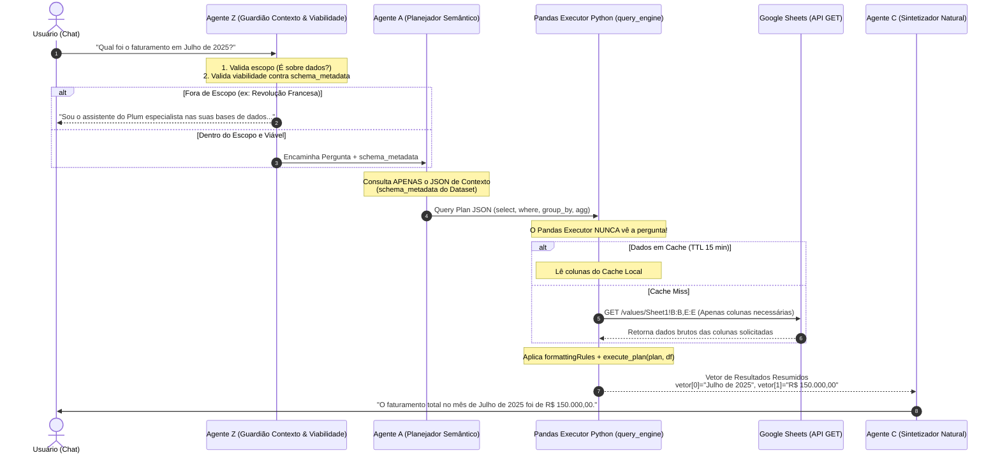

# PRD: Arquitetura Multitenant do Chat Conversacional & Query Engine 💬🧠

## 1. Visão Geral do Produto
O **Plum Chat Conversacional** é um motor enterprise de inteligência de dados (*Natural Language Query Engine*) projetado para permitir que usuários façam perguntas em linguagem natural sobre suas planilhas e bases de dados (conectadas via **Google Sheets**) e recebam respostas precisas, rápidas e contextualizadas.

A arquitetura adota um pipeline modular composto pelo **Agente Z (Guardião)**, pelo **Agente A (Planejador Semântico)**, pelo **Pandas Executor em Python (Motorista Cego)** e pelo **Agente C (Sintetizador Natural)**, garantindo **Multitenancy Estrito (Isolamento entre empresas)**, privacidade de dados e **precisão matemática de 100%**.

---

## 2. Princípios Fundamentais da Arquitetura

1. **Agente Z como Primeiro Filtro:** Qualquer mensagem é auditada antes de processar queries. Perguntas fora de contexto (ex: Revolução Francesa) são bloqueadas com resposta institucional amigável. Perguntas sobre colunas inexistentes na planilha são filtradas na hora.
2. **Cálculo Determinístico via Python/Pandas (`query_engine/pandas_executor.py`):** Modelos de IA (LLMs) **não realizam matemática**. O Agente A apenas gera um plano estruturado (Query Plan JSON). Quem executa o filtro, agrupamento e cálculos numéricos é o código Python em Pandas, eliminando 100% das alucinações numéricas.
3. **Motorista Cego (Blind Execution Pattern):** O executor (hoje um serviço AWS Lambda — ver §9) não recebe a pergunta do usuário, não conhece a intenção de negócio e **não consulta o Supabase**. Ele obedece um payload já assinado, contendo o conjunto de colunas já resolvido e autorizado. Toda decisão de autorização vive na Edge Function que o chama (`ai-plum-chat` ou `dashboard-execute`), nunca no executor.
4. **Acesso Somente Leitura (`GET` HTTP) + Column-Range GET:** O Plum **nunca** altera a planilha do cliente. Ele lê **somente as colunas necessárias** via `batchGet`, numa única chamada por dataset (não uma por card/pergunta — decisão 11A), contornando o limite de 60 req/min da API do Google Sheets. **O cache de dados em TTL mencionado nas versões anteriores deste PRD existe no código (`query_engine/cache.py`) mas está intencionalmente desligado** — ver §9.
5. **Multitenancy Inquebrável (Isolamento por `organization_id` & RLS):** Toda decisão de acesso é resolvida **antes** de chegar ao executor, na Edge Function, com o JWT do usuário e RLS do Postgres. A chamada da Edge Function para o executor em si é protegida por duas camadas independentes: assinatura **AWS SigV4** na própria infraestrutura (Lambda Function URL com `AuthType=AWS_IAM`) e uma **assinatura HMAC-SHA256 adicional**, com um segredo diferente da credencial AWS — vazar uma não basta para forjar a outra. Ver §9.
6. **Privacidade por Agregação (k-Anonimato):** Nenhum vetor de resultado sai sem passar por agregação (`RawRowsBlocked` recusa planos sem `select`/sem função de agregação) e todo grupo do resultado precisa ter no mínimo `k_min` linhas de origem (padrão 5); grupos menores são suprimidos antes de sair, e a contagem de suprimidos volta no resultado (`suppressed_groups`) para a interface poder explicar o buraco em vez de simplesmente mostrar menos linhas sem explicação.

---

## 3. Fluxo de Execução E2E (Diagrama de Sequência)

> **Status em 2026-08-07: este diagrama descreve o fluxo pretendido para o chat, que ainda
> não está ligado ao executor real.** `PlumChat.tsx` hoje monta um `mockPythonVetor` fixo em
> vez de chamar o Pandas Executor. O executor real (Lambda) já existe, está em produção e já
> tem um consumidor real — mas é o **dashboard** (`dashboard-execute`, ver §9), não o chat.
> Ligar o chat ao executor real é trabalho pendente, descrito em `implementation.md`.



---

## 4. Detalhamento dos Componentes e Agentes

### 🛡️ Agente Z: Guardião de Contexto & Viabilidade (*The Gatekeeper*)
- **Entradas:** Pergunta em linguagem natural + `schema_metadata` do Dataset.
- **Responsabilidade 1 (Contexto & Escopo):** 
  - Se a pergunta for totalmente alheia a dados ou negócios (ex: *"Resuma a Revolução Francesa"*, *"Me conte uma piada"*, *"Escreva um código em C++"*), o Agente Z bloqueia **imediatamente** antes de gastar qualquer token ou requisição do Google Sheets.
  - **Resposta Padrão Institucional:** *"Sou o assistente inteligente da Plataforma Plum especialista na análise das suas bases de dados e indicadores. Como posso te ajudar com os seus dados hoje?"*
- **Responsabilidade 2 (Viabilidade de Dados):**
  - Se a pergunta for sobre dados, mas solicitar colunas que **não existem** no `schema_metadata` (ex: pedir *"Qual o lucro líquido?"* quando só há `faturamento` sem nenhuma coluna de custos), ele responde amigavelmente explicando que os campos necessários não foram encontrados na base.

---

### 🤖 Agente A: O Planejador Semântico (*The Planner*)
- **Entradas:** Pergunta validada pelo Agente Z + `schema_metadata` do Dataset.
- **O que ele NÃO vê:** As linhas de dados reais da planilha.
- **Responsabilidade:** 
  - Converter o conceito em linguagem natural em um Query Plan JSON estrito aceito pelo `query_engine/pandas_executor.py`.
- **Exemplo de Saída do Agente A (Query Plan JSON):**
  ```json
  {
    "from": "producao",
    "select": [
      { "expr": { "agg": "sum", "col": "faturamento" }, "as": "faturamento_total" }
    ],
    "where": {
      "col": "data_venda",
      "op": "BETWEEN",
      "val": ["2025-07-01", "2025-07-31"]
    }
  }
  ```

---

### 🐍 Pandas Executor: O Motorista Cego Determinístico (`query_engine/pandas_executor.py`)
- **Entradas:** Query Plan JSON já autorizado (colunas resolvidas pela Edge Function) + `column_roles` (percent/date/number/text, derivado do `cleaning_rule` do schema) + `k_min` + `max_rows`.
- **O que ele NÃO vê:** A pergunta do usuário, qualquer contexto conceitual, e o Supabase — ele nunca faz uma query SQL.
- **Responsabilidade real hoje** (`execute_plan(plan, tables, *, column_roles, k_min, max_rows)`):
  1. Recusa a base inteira **antes de processar** se ela passar de `max_rows` (`RowLimitExceeded`) — o `limit` do plano só corta a saída, nunca protegeu a entrada, então essa checagem acontece à parte, mais cedo.
  2. Aplica `where`/`group_by`/`select`. Coluna referenciada e não carregada é **erro (`MissingColumnError`)**, nunca um filtro ignorado em silêncio — um filtro descartado devolveria o total sobre a base inteira com o rótulo do recorte pedido, um número errado com etiqueta convincente.
  3. Recusa devolver linhas brutas (`RawRowsBlocked`) quando `k_min > 0`: todo plano precisa de pelo menos uma função de agregação.
  4. Aplica **k-anonimato**: agrupa, agrega, e remove grupos com menos de `k_min` linhas de origem antes do vetor sair, retornando `suppressed_groups`.
  5. `column_roles` substitui as antigas constantes globais (`_PCT_COLS`/`_STRING_COLS`, que ficavam vazias e sem uso real) — evita, por exemplo, somar uma coluna de percentual.
- **O que NÃO mudou (dívida conhecida — ver `urgent.md`):** `apply_formatting_rules` e a nova `roles_from_formatting_rules` continuam decidindo o que fazer com cada coluna por **keyword-match em texto livre** (`cleaning_rule` escrito pelo Agente 3). Isso agora tem consequência maior do que quando o `urgent.md` foi escrito: `column_roles` alimenta a proteção de k-anonimato/percentual, então uma regra de limpeza que o Agente 3 escreveu fora do vocabulário reconhecido não é só uma coluna mal formatada — pode fazer o executor tratar errado uma coluna sensível.
- **Exemplo de Saída (vetor de resultado, um `card_id` por card no lote):**
  ```json
  {"results": [
    {"card_id": "...", "status": "ok",
     "columns": ["regiao", "total"],
     "rows": [{"regiao": "Sul", "total": 150000.0}],
     "row_count": 1, "suppressed_groups": 0}
  ]}
  ```

---

### 🗣️ Agente C: O Sintetizador Natural (*The Communicator*)
- **Entradas:** A pergunta do usuário + O Vetor de Resultados gerado pelo Pandas Executor.
- **O que ele NÃO vê:** A base de dados com 100.000 linhas.
- **Responsabilidade:**
  - Formatar a resposta em português brasileiro executivo, claro e natural.
  - Exemplo: *"O faturamento total registrado no mês de Julho de 2025 foi de **R$ 150.000,00**."*

---

## 5. Arquitetura Multitenant & Isolamento de Dados (Ideia 4)

Para garantir segregação inquebrável de dados entre diferentes empresas na plataforma, hoje
(caminho do dashboard — ver §9) a cadeia é:

```
[Requisição HTTP — Edge Function `dashboard-execute`, roda no Deno, RLS ativo]
   │
   ├─► 1. Autenticação JWT: auth.getUser() com o Authorization do request. Perfil precisa
   │      estar 'ativo' e ter role_id — sem cargo não existe allowed_columns, e "sem
   │      permissão" nunca é interpretado como "todas as permissões".
   ├─► 2. Validação RLS (Supabase Postgres): dataset precisa pertencer à organization_id
   │      do perfil; cards precisam pertencer à mesma organização.
   ├─► 3. RBAC de coluna: allowed_columns de role_permissions × colunas que o Query Plan
   │      realmente referencia (extração recursiva única, em `_shared/query_plan.ts`,
   │      testada por vitest — nenhuma segunda implementação em Python).
   └─► 4. Só então: payload assinado (SigV4 + HMAC) sai para o executor Lambda, que não
        conhece organização, cargo nem RLS — ele só compara o conjunto de colunas resolvido
        contra allowed_columns de novo (defesa em profundidade, decisão 2A/8A).
```

O isolamento entre tenants **não é garantido pelo lado do executor** — a service account do
Google (`reader@plum-ai.iam.gserviceaccount.com`) tem leitura em toda planilha de todo
cliente. Ele é garantido inteiramente pela Edge Function, que é o único lugar do caminho onde
o JWT do usuário e o RLS existem ao mesmo tempo. Ver `supabase/functions/dashboard-execute/index.ts`.

---

## 6. Otimização de Performance & Cotas do Google Sheets (Ideia 2)

1. **Um `batchGet` por dataset, não por pergunta/card (decisão 11A):** seis cards do mesmo
   dashboard fazem **uma** leitura no Google, com a união das colunas de todos, em vez de seis
   chamadas separadas — é isso, e não cache, que resolve a cota de 60 req/min na prática.
2. **Teto de linhas verificado ANTES do parse (decisão 10A):** a contagem de linhas vem dos
   metadados da planilha (resposta pequena) e a leitura é abortada antes de qualquer dado
   entrar em memória, se passar do teto configurado por organização.
3. **Cache de metadados (header + contagem de linhas), 15 min, em memória do processo** —
   guarda só nome de coluna e contagem de linhas, nunca dado de cliente.
4. **O cache de DADOS (linhas reais) com TTL de 15 min, que versões anteriores deste PRD
   descreviam como já ativo, existe no código (`query_engine/cache.py`) mas está
   deliberadamente desligado.** Motivo: estender a vida de uma linha bruta do cliente de "uma
   requisição" para "quinze minutos na memória do processo" muda a postura de privacidade do
   produto, e essa é uma decisão que precisa ser tomada conscientemente, não herdada de um
   commit de passagem. Ver `TODOS.md` item 1 para a decisão pendente e o que falta para ligar.

---

## 7. Resumo das Responsabilidades da Arquitetura

| Componente | Tipo | Função Principal |
| :--- | :--- | :--- |
| **Agente Z** | LLM Prompt (Agente 0) | Guardião de Escopo (bloqueia "Revolução Francesa") e Viabilidade de Colunas. |
| **Agente A** | LLM Prompt (Agente 1) | Converte linguagem natural em Query Plan JSON (filtro, select, agg). |
| **Pandas Executor** | Python, AWS Lambda (`query_engine`) | Executa filtros, agrupamentos, k-anonimato e matemática exata com Pandas (Motorista Cego). Sem acesso ao Supabase. |
| **Agente C** | LLM Prompt (Agente 2) | Transforma o resultado numérico do Pandas em resposta natural fluida. |
| **Supabase Postgres** | Banco Multitenant | Validação de RLS por `organization_id` e armazenamento do `schema_metadata`. |
| **Edge Function `dashboard-execute`** | Deno, único ponto de RBAC | Autoriza por coluna, assina (SigV4+HMAC) e chama o Lambda; degrada para snapshot antigo se o executor falhar. |

---

## 8. Variáveis de Ambiente

> **Reescrito em 2026-08-07 — a versão anterior desta seção descrevia um mecanismo que nunca
> chegou a ser implementado** (um `.env` com o JSON direto, `GOOGLE_CLOUD_CREDENTIALS`, projeto
> GCP "Plataforma Plum"). O que existe de fato, no serviço Lambda real (`query_engine/config.py`):

| Variável de ambiente (na função Lambda) | Conteúdo | Não é |
| :--- | :--- | :--- |
| `GOOGLE_SA_PARAM` | **Caminho** do parâmetro no SSM: `/plum/prod/google-sa-json` | Não é o JSON em si |
| `HMAC_SECRET_PARAM` | **Caminho** do parâmetro no SSM: `/plum/prod/hmac-secret` | Não é o segredo em si |
| `PLUM_K_MIN` | Mínimo de linhas por grupo (padrão `5`) — hoje sobrescrito por `organizations.dashboard_k_min` no caminho do dashboard | — |
| `PLUM_MAX_ROWS` | Teto de linhas por base (padrão `200000`) — idem, sobrescrito por `organizations.dashboard_max_rows` | — |
| `PLUM_SIGNATURE_MAX_AGE` | Janela de validade do HMAC em segundos (padrão `120`) | — |

O **valor** de cada segredo nunca é uma env var — só o caminho. `query_engine/config.py` lê o
valor em tempo de execução, nesta ordem: (1) a extensão *AWS Parameters and Secrets*
(`localhost:2773`, com cache local — só a primeira leitura de cada cold start toca o Parameter
Store de verdade), (2) `boto3` direto (cobre execução fora do Lambda), (3) uma env var com
sufixo `_VALUE` — **só para teste local**, nunca em produção.

Detalhes que corrigem a versão anterior desta seção:
- **Projeto Google Cloud correto: `plum-ai`** (não "Plataforma Plum"). Service account:
  `reader@plum-ai.iam.gserviceaccount.com`.
- **Escopo: só `https://www.googleapis.com/auth/spreadsheets.readonly`.** O escopo
  `drive.readonly` mencionado antes não é usado em nenhum lugar do código real — o serviço
  nunca chama a API do Drive, só a do Sheets.
- **Armazenamento: SSM Parameter Store (`SecureString`, criptografado com KMS), não Secrets
  Manager.** Motivo prático: mais barato no volume atual (o tier padrão do Parameter Store não
  cobra por parâmetro) e suficiente, já que não há necessidade de rotação automática agendada.
- **Nunca fica em disco.** Sai do Parameter Store direto para a memória do processo Lambda e
  morre com o container — nem `/etc`, nem arquivo temporário, nem imagem Docker.
- **Efeito colateral de operação a saber:** `get_secret()` usa `@lru_cache`, então um container
  Lambda já "quente" nunca relê o parâmetro depois da primeira vez. Trocar o segredo no SSM
  não afeta uma execução em andamento nem containers já quentes — só passa a valer para
  containers novos (cold starts, ou depois do Lambda reciclar naturalmente). Para forçar a
  troca imediata, é preciso publicar uma nova versão da função (o que recicla os containers).
- Provisionamento de ambos os parâmetros: `infra/aws/provision.sh` (`ETAPA 2` do
  `infra/aws/PASSO-A-PASSO.md`). Fonte de verdade para como subir isso — este PRD não duplica
  o passo a passo.

---

## 9. Estado real de implementação (2026-08-07)

Esta seção existe para a próxima pessoa não precisar reconstruir, lendo código, o que já foi
decidido. Ela substitui a antiga suposição de que o executor rodaria numa EC2 (ver
`query_engine/implementation.md`, marcado como superado).

**O que está em produção:**
- O executor (`query_engine/main.py`, `security.py`, `sheets.py`, `config.py`,
  `pandas_executor.py`) roda como **imagem de container em AWS Lambda**, atrás de uma
  **Function URL com `AuthType=AWS_IAM`** — não é um endpoint público. Deploy via GitHub
  Actions com OIDC (sem chave AWS de longa duração), documentado em `infra/aws/`.
- O único consumidor real hoje é o **dashboard** (`dashboard_cards` /
  `dashboard_card_snapshots`, Edge Function `supabase/functions/dashboard-execute/index.ts`).
  Ele resolve RBAC de coluna, cacheia por "impressão digital de permissão"
  (`permissionsFingerprint` — hash das `allowed_columns`, não do `role_id`, para que revogar
  uma coluna invalide o cache automaticamente) e degrada para o último snapshot com selo de
  idade (`status: "stale"`) se o executor falhar ou estourar o tempo.
- O interpretador de Query Plan (extrair quais colunas um plano usa, recursivamente, incluindo
  `where` aninhado em `and`/`or`) existe **uma única vez**, em
  `supabase/functions/_shared/query_plan.ts`, testado por `vitest`. O Python nunca reimplementa
  essa extração — só compara o conjunto que já vem resolvido contra `allowed_columns` de novo,
  como segunda barreira.

**O que NÃO está feito — o chat continua mockado:**
`PlumChat.tsx` chama `ai-plum-chat` (`guard` → `plan_query` → `synthesize_answer`), mas o passo
do meio nunca chega a tocar o executor: o vetor de resultado usado na síntese é
`{ rows: [{ valor: "Simulado" }], msg: "Execução do Pandas pendente da API Python." }`, fixo no
código. Ligar o chat ao executor real é o próximo passo natural, e o caminho recomendado é
**reaproveitar o padrão do `dashboard-execute`**, não reinventar um segundo cliente do Lambda:
1. `ai-plum-chat` (ou uma nova Edge Function dedicada) importa `_shared/query_plan.ts` para
   extrair as colunas do plano do Agente A e validar contra `allowed_columns` do cargo do
   usuário para o dataset — assim o chat ganha o mesmo RBAC de coluna que o dashboard já tem,
   e que o chat hoje **não tem nenhum**.
2. Monta o mesmo formato de payload que `dashboard-execute` monta (`ExecutionPayload`: um
   único item em `plans`, com um `card_id` sintético), assina com `signPayload` +
   `AwsClient`/SigV4, e chama o mesmo Function URL.
3. O resultado (`results[0]`) alimenta `synthesize_answer` no lugar do mock.

**Dívidas explicitamente aceitas e registradas (não "esquecidas" — ver `TODOS.md` para o
raciocínio completo de cada uma):** cache de dados desligado por decisão de privacidade
pendente (item 1); sem streaming para bases grandes, com teto explícito em vez disso (item 2);
sem testes E2E dos fluxos combinados ainda (item 3); a premissa "a IA nunca lê seus dados" é
falsa hoje porque `predict_semantics`/`format_data` ainda recebem 5 linhas reais da planilha
(item 6, **de outro dono**, registrado como risco conhecido).

**Crítica para quem for mexer a seguir:**
- `apply_formatting_rules`/`roles_from_formatting_rules` continuam por keyword-match em texto
  livre (ver `urgent.md`). Isso deixou de ser só "uma coluna mal formatada" — agora
  `column_roles` alimenta a proteção de k-anonimato e a decisão de não somar percentual, então
  vale reabrir `urgent.md` com essa consequência nova em mente antes de considerá-lo baixa
  prioridade.
- `query_engine/cache.py` está escrito, testado (implicitamente, por ser código simples) e
  **não importado em lugar nenhum**. Fica fácil um contribuidor futuro assumir que está ativo
  porque o arquivo existe e parece pronto. Vale um comentário no topo do arquivo apontando para
  `TODOS.md` item 1, para quem abrir o arquivo sozinho (sem ler `TODOS.md` antes) não presumir
  que está ligado.
- Este PRD e o `CLAUDE.md` do repositório ainda descrevem a arquitetura de IA (§5 do
  `CLAUDE.md`) sem mencionar Lambda, `dashboard-execute`, k-anonimato ou o RBAC de coluna. Vale
  atualizar o `CLAUDE.md` numa próxima passada — não foi feito aqui porque não foi pedido nesta
  tarefa, e é um arquivo sensível o suficiente para merecer atenção própria.
